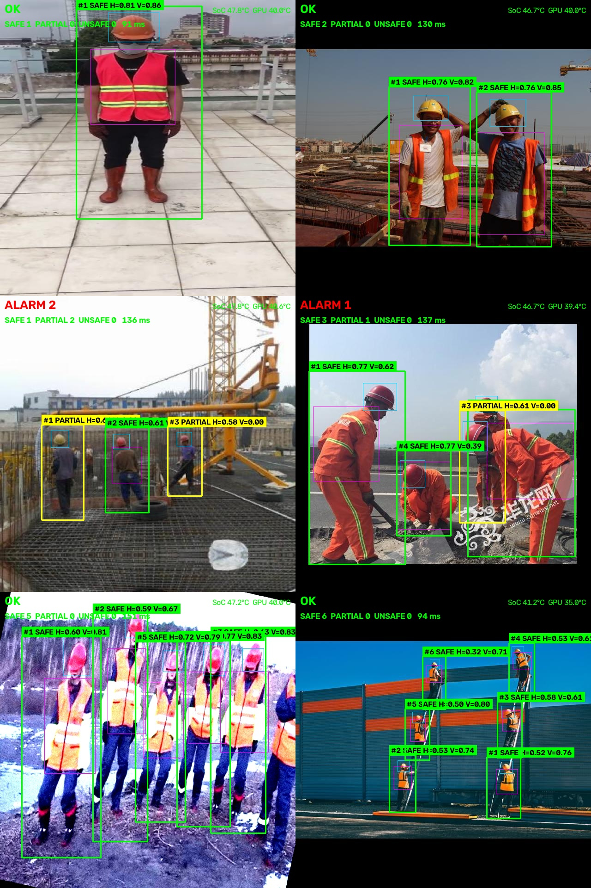

# 工地安全着装检测终端（RK3568）

当前版本：v2.0.1

跑在 Firefly ROC-RK3568-PC 上的工地着装检测程序：USB 摄像头输入，板端 NPU 推理，判断安全帽和反光衣有没有穿戴齐全，违规时保存截图和前后录像，通过 MQTT 推到手机，同时提供网页实时画面。所有推理、告警截图与视频数据均在本地处理与存储，远程访问通过加密内网通道完成，数据不出厂区，满足工业场景对隐私保护和低延迟的要求。

## 推理演示



## 背景

工地要求作业人员佩戴安全帽、穿反光安全衣，但传统人工巡查效率低、覆盖有限，难以做到全天候、全区域监管。为此，本项目基于 RK3568 设计了一套边缘 AI 安全终端，将目标检测、违规判定、声光告警与远程查看集成在一块低功耗开发板上，支持 7×24 小时无人值守运行。

## 功能

- 安全帽、反光衣检测，逐人给出 SAFE / PARTIAL / UNSAFE，画面按状态着色
- 逐人跟踪加连续帧确认，单帧误检不会触发告警
- 违规告警：截图 + 前后视频片段，经 MQTT 发布，手机端用 ntfy 接收
- 板端 MJPEG 实时画面，手机浏览器直接打开
- MQ-2 烟雾报警，和着装告警走同一条推送通道
- 摄像头掉线时服务不退出，显示占位画面，插回后自动恢复检测
- 远程查看可选：板子和手机都装 Tailscale 后，在外网也能收告警、看画面，不用开公网端口

## 检测方案

用单个 YOLOv8n 模型（4 类：person / helmet / no_helmet / vest）做一次推理，同时得到人框和帽/衣框，再把装备归属到对应的人。

### 三态判定

- 同时匹配到帽子、反光衣：SAFE
- 只匹配到其中一样：PARTIAL
- 都没匹配到：UNSAFE

no_helmet 类不参与判定，没戴帽的人由"匹配不到 helmet"得出。

### 装备归属

归属按"装备框落在该人对应部位区域内的比例"计算（分母是装备框面积）：安全帽看人框上方的头部区域（向上外扩 30%，因为头顶常伸出人框），反光衣看躯干区域；再与"装备框落在人框内的比例"取大作为兜底。

多人重叠时，把所有候选按比例从高到低贪心分配，**每人最多一顶安全帽 + 一件反光衣**，每件装备只给一个人，避免"一个人抢走两件、旁边的人一件都没有"。详细分析和验证见 `docs/多人重叠装备归属修复报告.md`。

### 单模型与两级方案

早先的版本是两级的：先跑 COCO 人形检测，再对每个人裁剪后跑一个 3 类装备模型。现在只有一次 NPU 推理，不再按人数裁剪，耗时与画面里的人数无关，也没有两级级联带来的误差累积。

### 模型输出格式

模型输出是 headcut 形式。rknn-toolkit2 1.3.0 编译不了 YOLOv8 的 DFL/dist2bbox 尾巴，所以转换时把 sigmoid 之后的原始张量直接当模型输出，DFL 解码、锚点还原和 NMS 放在板端 Python 里做。

## 部署

### 环境

| 项 | 说明 |
| --- | --- |
| 硬件 | Firefly ROC-RK3568-PC（4×Cortex-A55 / 4GB RAM / eMMC），USB UVC 摄像头 |
| 系统 | Ubuntu 20.04.6 LTS，Python 3.8.10，内核 4.19.232 |
| NPU | 驱动 0.8.2 + librknnrt 1.3.0，配套 rknn-toolkit-lite2 2.3.2（镜像预装） |
| Python | numpy 1.24.4，OpenCV 5.0.0.93，paho-mqtt 2.1.0 |

板端根文件系统是 overlayroot，底层 `/root-ro` 只读，可写层在 `/userdata`。告警截图和录像写在用户目录，按 `alerts.max_records`（默认 100 对）自动清理最旧的记录。内核较老（4.19）时 RGA 硬件缩放可能比 OpenCV 还慢，程序启动时会实测再决定用哪个，不需要手动设置。

### 安装

板端镜像一般已经装好 Python 依赖，先确认这几个系统命令：

```bash
sudo apt install -y gpiod v4l-utils mosquitto mosquitto-clients
sudo apt install -y ffmpeg            # 可选，用来把告警录像转成 H.264
```

换到缺依赖的机器时再补 Python 部分：

```bash
pip3 install -r requirements.txt
```

### 配置

```bash
cp config/safe_config_git.json config/safe_config.json
```

实际部署值写在 `config/safe_config.json`：摄像头节点、传感器 GPIO/ADC 接线与报警阈值、MQTT 账号、端口等。这个文件在 `.gitignore` 里，不会上传；`config/safe_config_git.json` 是可以上传的公开模板，字段完全一致。程序优先读私有配置，没有（比如刚 clone 下来）就退回模板，因此不配也能先跑起来。

## 使用

### 常用命令

```bash
./run.sh --source /dev/video0 --noshow        # USB 摄像头，节点按实际填
./run.sh --img test.jpg --out out.jpg         # 单张图片调试，打印每个人的置信度
./run.sh --dir ~/frames --out-dir ~/out       # 批量图片，出图并写 CSV 报告
./run.sh --source ~/site.mp4                  # 回放视频文件，按原帧率
./run.sh --bench 30                           # 分阶段性能测试
```

### 实时画面与手机告警

实时画面在 `http://<板子IP>:8090/`。手机告警需要装 ntfy 并订阅主题 `safe_cam1`，服务地址为 `http://<板子IP>`。

告警推送依赖 mosquitto / Node-RED / ntfy，用 `deploy/install_notify_stack.sh` 可以一次装好，systemd 单元和 Node-RED 流程文件都在 `deploy/` 下。

### 远程访问（可选）

同一局域网内直接访问即可，不需要额外组件。要出门也能看时，板子和手机都装 [Tailscale](https://tailscale.com/) 并登录同一账号：

```bash
curl -fsSL https://tailscale.com/install.sh | sh   # 板端安装
sudo tailscale up                                  # 打印授权链接，用浏览器登录
tailscale ip -4                                    # 板子的虚拟 IP，手机用它访问
```

装好后实时画面、告警截图、录像链接都走这个虚拟 IP，公网不用开端口。没装 Tailscale 也照常运行，程序会自动探测可用地址，优先 Tailscale，其次局域网 IP。

## 性能

RK3568，int8，640 输入：

| 场景 | 端到端延迟 | 说明 |
| --- | --- | --- |
| 无人 / 单人 | ~85 ms | NPU 推理为主，后处理可忽略 |
| 多人（低重叠，如规则排列） | ~95 ms | 后处理计算量小 |
| 多人（高重叠，如密集站立） | 130~150 ms | IoU 匹配和装备归属开销增加 |

## 目录结构

```
├── app/          # 入口、解码与装备归属、合规状态机、推流、告警、录像、传感器
├── config/       # safe_config_git.json（公开模板）/ safe_config.json（私有，不入库）
├── models/       # RKNN 模型与版本说明
├── deploy/       # systemd 单元、udev 规则、Node-RED 流程、部署脚本
└── alerts/       # 告警截图与录像（运行产物，不入库）
```

## 模型

一阶段模型基于 [Ultralytics YOLOv8n](https://github.com/ultralytics/ultralytics)，在 Construction-PPE 数据集上训练，4 类 `person / helmet / no_helmet / vest`，本项目仅供学习与交流，非商业用途。

### 版本约束

模型版本必须和板端 librknnrt 同代：本板是 1.3.0，只认 version 2；用 2.x 工具链转出来的是 version 6，上板会加载失败。

### 重新生成

模型文件放在 `models/`，转换脚本在 `../SafeDetect_Model_trans/`。

## 演示视频与实物图

演示视频：<https://b23.tv/N3P0mBH>


## 参考

- [RKNN-Toolkit2](https://github.com/airockchip/rknn-toolkit2)
- [Firefly ROC-RK3568-PC 文档](https://wiki.t-firefly.com/zh_CN/ROC-RK3568-PC/started.html)
- [Ultralytics YOLOv8](https://github.com/ultralytics/ultralytics)
- [Tailscale](https://tailscale.com/)
- [ntfy](https://ntfy.sh/)

联系邮箱：1995466@qq.com
